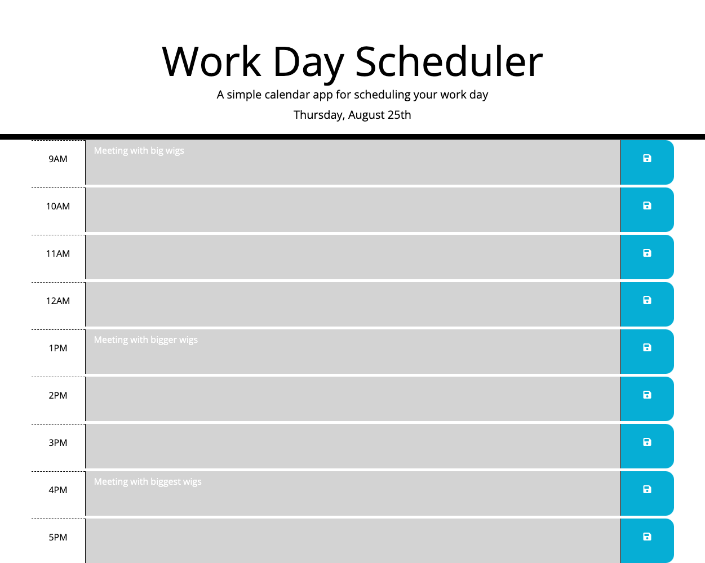

# Workday Scheduler Refactor Project

## Table of Contents

[Description](#description)

[Visuals](#visuals)

# Description

[Link to live site.](https://nsantander1095.github.io/workday-scheduler-refactor-project/)

The workday scheudler is now a functioning scheduler that runs between the time 9am and 5pm. You can write indivudal scheduled events in the boxes provided and they will be saved to local storage upon click of the save icon. All of those individual events are colorcoded so that the events show gray when past, red when present, and green for in the future. Further, the scheduler displays the current day of the week, as well as the month and that date. Upon first inspection of the live link I had to turn off "enable JavaScript source maps" and "enable CSS source maps" for the save feature to load. I don't know if it was that or maybe my adblock that was inhibiting that, but it works now. 

# Visuals
